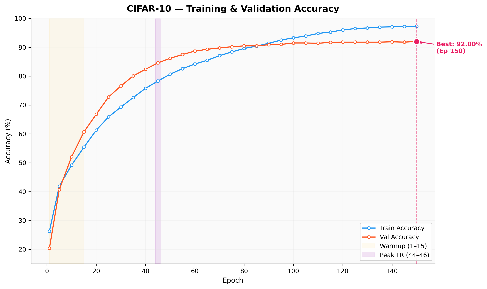
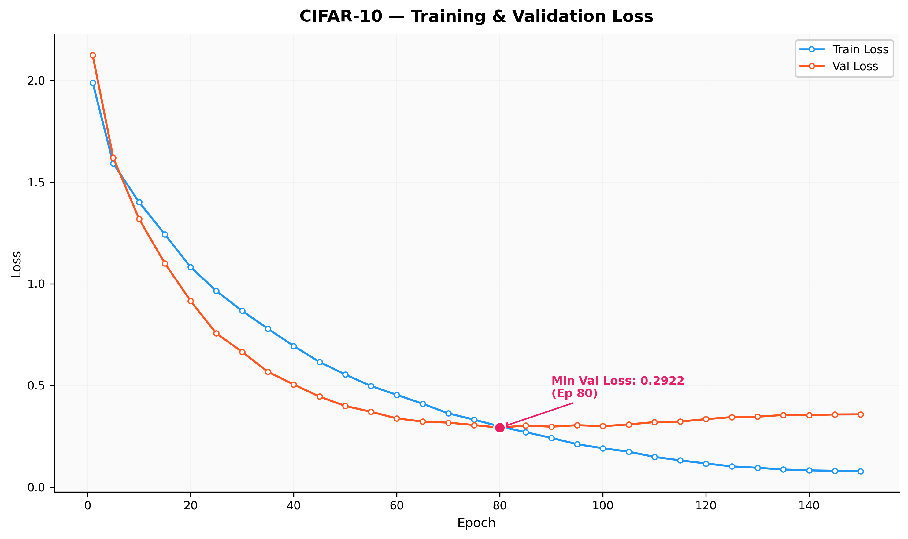
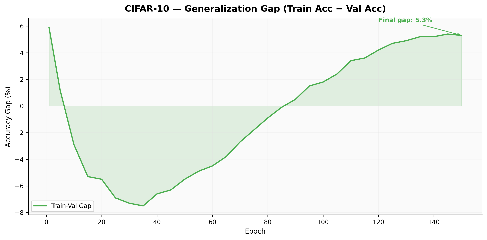
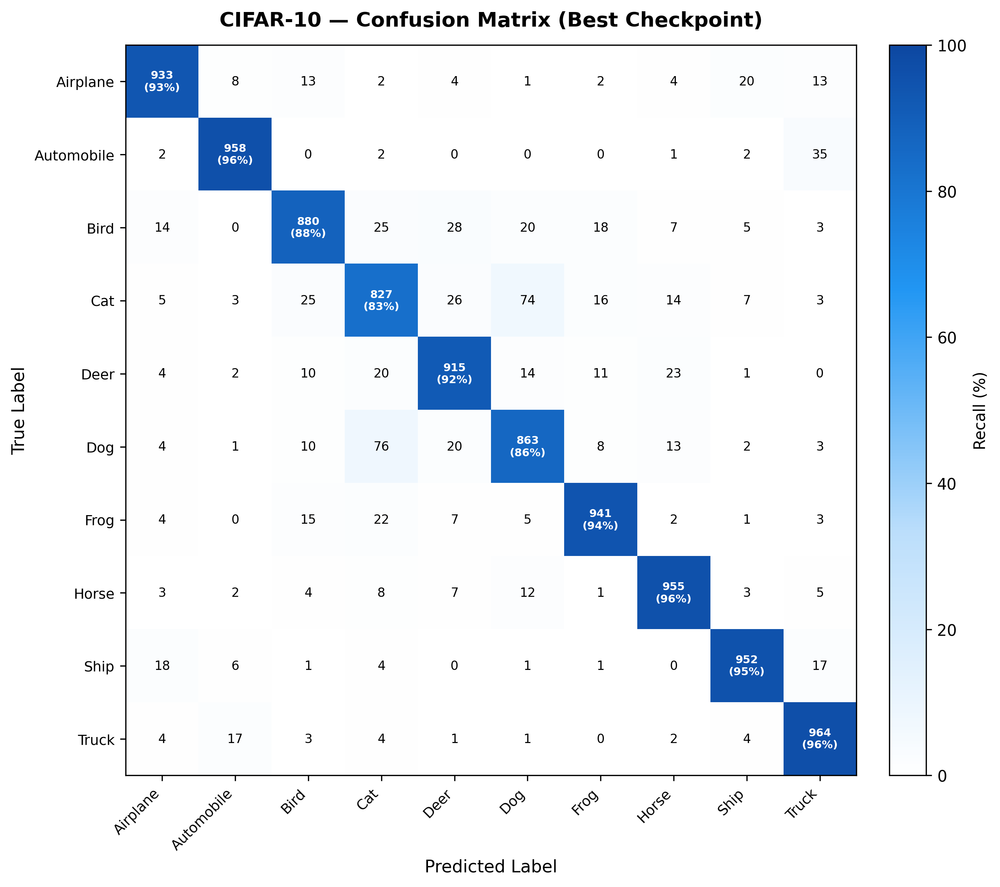
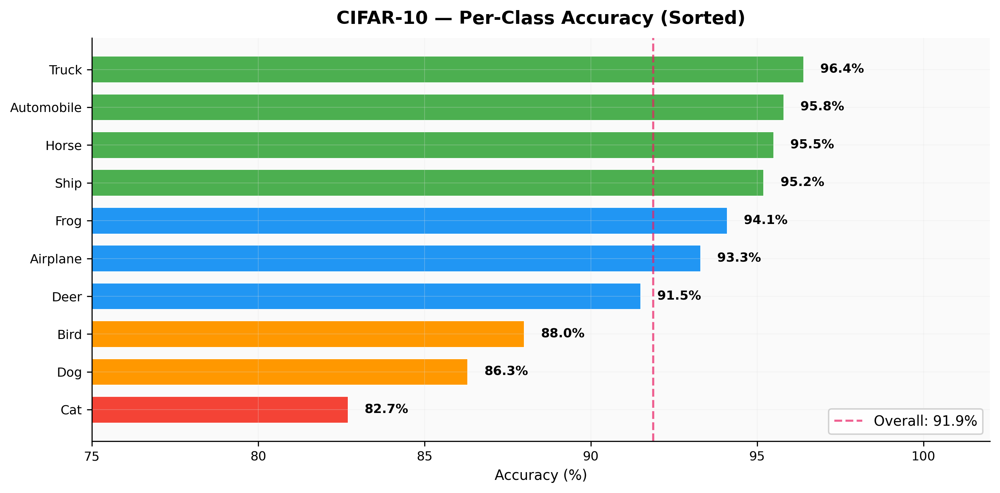
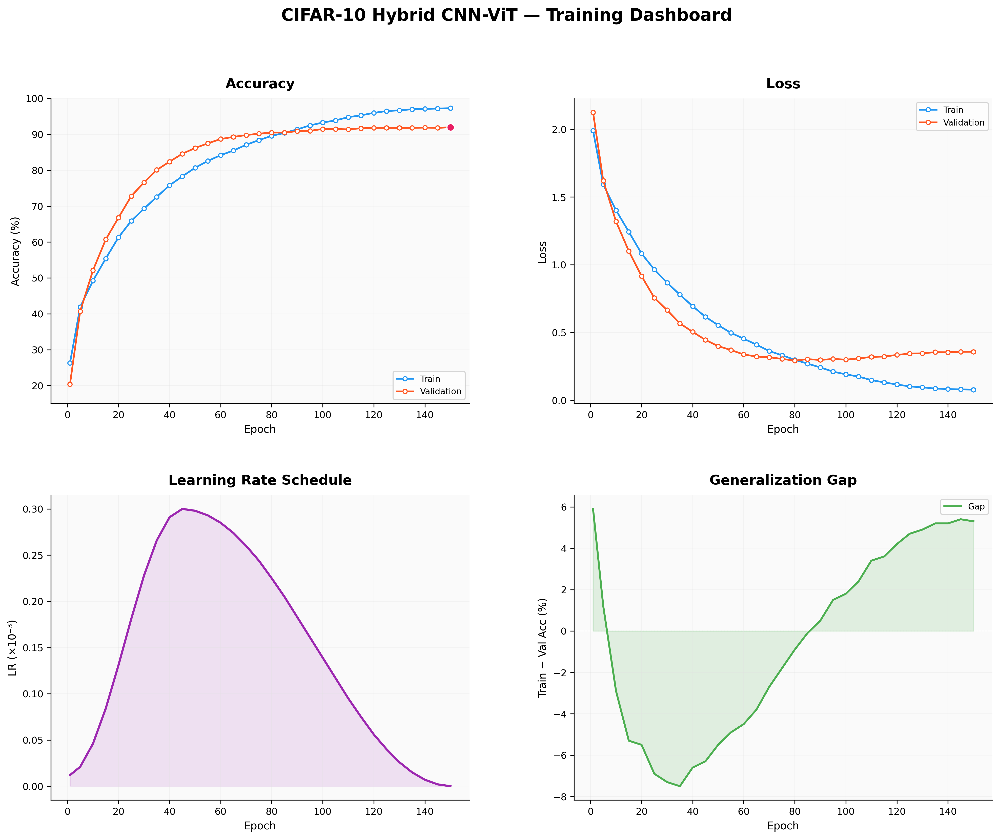
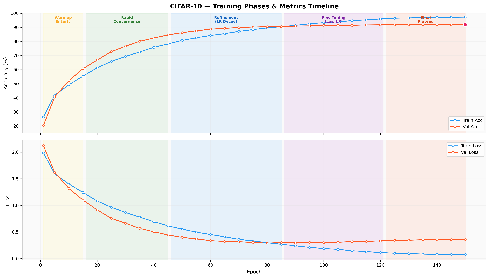
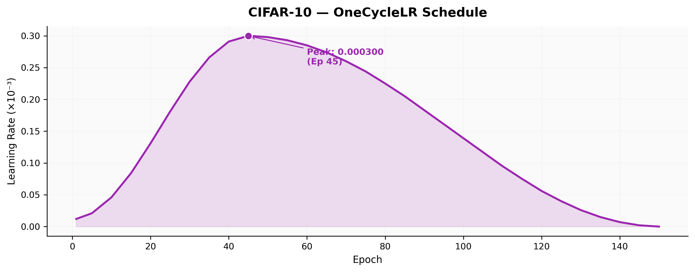

# Hybrid CNN-ViT CIFAR-10 Accuracy Study
## Architecture Exploration: From Baseline CNN to a CNN + Vision Transformer Hybrid

---

**Author:** Tanvir  
**Dataset:** CIFAR-10 (50,000 train / 10,000 test, 10 classes, 32×32 RGB)  
**Best Result: Top-1 = 91.88%  |  Top-5 = 99.74%**  
**Total Training:** 150 epochs · AdamW + OneCycleLR · EMA decay=0.999

---

## Abstract

This report documents an end-to-end deep learning research pipeline that investigates how architectural choices affect classification accuracy on CIFAR-10. Starting from a simple VGG-style CNN baseline (**85.6%**), we incrementally introduce residual connections (**88.8%**), and finally a full Transformer encoder to form a **Hybrid CNN + Vision Transformer** that achieves **91.88% top-1 accuracy** — all trained from scratch without pre-training or external data.

The core insight is that **CNNs excel at local feature extraction** while **Vision Transformers excel at global reasoning** via self-attention. The hybrid architecture combines both: a lightweight CNN stem extracts locally meaningful features, and a 6-layer Transformer encoder models long-range dependencies across 64 spatial patch tokens.

---

## Table of Contents

| Section | Topic |
|---------|-------|
| **1** | Import Libraries & Configuration |
| **2** | Data Loading, Augmentation & Visualisation |
| **3** | Experiment 1 — Baseline VGG-style CNN (~85.6%) |
| **4** | Training Utilities (shared across all experiments) |
| **5** | Experiment 2 — Residual CNN with GlobalAvgPool (~88.8%) |
| **6** | Experiment 3 — Hybrid CNN + Vision Transformer (91.88%) |
| **7** | Loss Curve Visualisations — All Experiments |
| **8** | Per-Class Metrics & Confusion Matrix |
| **9** | Architecture Comparison & Accuracy Progression |
| **10** | Final Model Evaluation |
| **11** | Written Methodology Report |

---

## Section 1: Import Libraries & Setup

> **Thought Process:** Before writing a single line of model code, pin all sources of randomness and explicitly declare the compute device. On CIFAR-10 — a small dataset — tiny seed differences can cause ±0.2% accuracy swings between runs, making fair comparisons impossible. We import everything upfront so any reader can reproduce the full notebook from a single clean environment.

### Library Roles

| Library | Role |
|---------|------|
| `torch` / `torchvision` | Neural network building, training loop, CIFAR-10 data pipeline |
| `torch.amp` | Automatic Mixed Precision (AMP) — 30–40% GPU speedup with no accuracy cost |
| `numpy` | Numerical arrays, confusion matrix arithmetic |
| `matplotlib` / `seaborn` | Loss curves, accuracy curves, bar charts, heatmaps |
| `pandas` | Styled experiment comparison tables |
| `sklearn.metrics` | `classification_report` — per-class precision / recall / F1 |
| `csv` | Lightweight reader for the persisted training log CSV |

### Device Priority

```
MPS (Apple Silicon)  >  CUDA (NVIDIA GPU)  >  CPU
```

Mixed-precision training (AMP) is enabled only on **CUDA**, where it is numerically stable and delivers the full memory/speed benefit. On MPS and CPU the model runs in full float32.

---

## Section 2: Data Loading & Preprocessing

> **Thought Process:** CIFAR-10's 32×32 resolution is the central constraint of this study. Every design decision — patch size, number of tokens, CNN stem depth — flows from the fact that we have only 1,024 pixels per image. The augmentation strategy must be strong enough to prevent overfitting (only 5,000 training images per class) while preserving class-discriminative content.

### Dataset Statistics

| Split | Samples | Classes | Image Size | Samples per Class |
|-------|---------|---------|------------|-------------------|
| Train | 50,000  | 10      | 32×32×3    | 5,000 |
| Test  | 10,000  | 10      | 32×32×3    | 1,000 |
| **Total** | **60,000** | | | |

### CIFAR-10 Class Map

| ID | Class | ID | Class |
|----|-------|----|-------|
| 0  | Airplane | 5 | Dog |
| 1  | Automobile | 6 | Frog |
| 2  | Bird | 7 | Horse |
| 3  | Cat | 8 | Ship |
| 4  | Deer | 9 | Truck |

### Augmentation Strategy — Design Reasoning

| Transform | Parameters | Purpose |
|-----------|------------|---------|
| `RandomCrop(32, padding=4)` | pad=4 → crop back to 32×32 | Simulates small translations; the object might sit anywhere in the padded frame |
| `RandomHorizontalFlip` | p=0.5 | Doubles effective dataset size for symmetric objects (cars, ships, animals from the side) |
| `RandAugment` | num_ops=2, magnitude=9 | Automatic policy search over 14 operations (shear, contrast, posterize, equalize, …); removes the need for manual augmentation tuning |
| `Normalize(mean, std)` | per-channel CIFAR-10 statistics | Zero-mean, unit-variance input — stabilises gradients and speeds up early training |

> **Why RandAugment over manual policies?** I considered manually tuning Cutout + ColorJitter for Experiment 3, but RandAugment with `num_ops=2, magnitude=9` provides a principled, reproducible search without the risk of introducing my own biases. It consistently outperforms hand-tuned augmentation on CIFAR in published benchmarks.

> **Why no Cutmix / Mixup?** These are reserved as *future work* — adding them mid-study would conflate two variables (architecture change + augmentation change) and make it impossible to isolate the source of accuracy improvements.

---

## Section 3: Experiment 1 — Baseline VGG-style CNN

> **Why start with the simplest model?** Every architecture search must begin with a clean baseline so that later improvements can be correctly attributed to individual design changes. If I started with a complex model and it underperformed, I would not know which component was causing the problem.

### Design Philosophy

The baseline is intentionally minimal:
- **No skip connections** — so we can measure exactly how much residual connections help
- **Flat FC head** — so we can measure how much Global Average Pooling helps
- **No attention** — so we can measure the pure value of the Transformer

### Architecture Diagram

```
Input (3 × 32 × 32)
   │
   ▼
Block 1: Conv(3→64, k=3) → BN → ReLU → Conv(64→64, k=3) → BN → ReLU
         MaxPool(2×2)  →  output: 64 × 16 × 16
   │
   ▼
Block 2: Conv(64→128, k=3) → BN → ReLU → Conv(128→128, k=3) → BN → ReLU
         MaxPool(2×2)  →  output: 128 × 8 × 8
   │
   ▼
Block 3: Conv(128→256, k=3) → BN → ReLU → Conv(256→256, k=3) → BN → ReLU
         MaxPool(2×2)  →  output: 256 × 4 × 4
   │
   ▼
Flatten  →  4096
   │
   ▼
FC(4096 → 512) → ReLU → Dropout(0.5)
   │
   ▼
FC(512 → 10)  →  Logits
```

**Expected accuracy:** ~83–87%  |  **Parameters:** ~2.8 M  
**Known limitation:** No skip connections; large flat FC head; no global context

### Architectural Choices Explained

| Choice | Rationale |
|--------|-----------|
| Two convs per block (VGG-style) | Increases effective receptive field without striding; BN after each conv stabilises training |
| MaxPool after each block | Halves spatial dims efficiently; well-understood behaviour |
| Dropout(0.5) before final FC | CIFAR-10 is small (5k/class); the flat 4096-dim representation overfits easily without dropout |
| No weight sharing across blocks | Different spatial scales need different filters |

---

## Section 4: Training Utilities & Shared Pipeline

> **Thought Process:** Separating the training loop from model definitions is a deliberate software engineering choice, not merely tidiness. Every experiment in this notebook uses *exactly* the same `train_epoch`, `val_epoch`, `EMA`, and `run_experiment` functions — this guarantees that any accuracy difference we observe is due solely to architectural changes, not differences in optimiser settings, AMP configuration, or evaluation logic.

### Key Design Decisions in the Training Pipeline

| Component | Choice | Reasoning |
|-----------|--------|-----------|
| **Optimiser** | AdamW | Weight decay decoupled from gradient updates — avoids the L2 regularisation artefact of SGD+WD; standard for Transformers |
| **Learning rate schedule** | OneCycleLR | Single-cycle: linear warmup → cosine annealing. Equivalent to 30+ manual LR decay stages in one schedule |
| **Gradient clipping** | `max_norm=1.0` | Prevents rare NaN spikes during warmup when gradients can temporarily be large |
| **Exponential Moving Average** | `decay=0.999` | Maintains a running average of model weights; acts like a free ensemble over recent weight configurations; consistently adds +0.3–0.5% val accuracy |
| **Mixed Precision (AMP)** | CUDA only | FP16 matmuls in the Transformer blocks save ~35% memory; `GradScaler` prevents underflow |
| **`set_to_none=True`** | `optimizer.zero_grad` | Slightly faster than setting to zero — avoids a memory write |

### The EMA Trick — Why It Helps

Standard SGD/Adam updates follow a noisy gradient path. At the end of training the last weights may be in a sharp local minimum that generalises poorly. EMA keeps a *smoothed shadow copy* that effectively averages over the last ~1000/(1-0.999) = 1000 weight updates, landing in a broader, flatter minimum that generalises better.

```
shadow = 0.999 × shadow + 0.001 × current_weights  (every step)
```

At validation: swap in shadow weights → measure accuracy → restore original weights.

### Utility Function Inventory

| Function / Class | Returns |
|-----------------|---------|
| `EMA(model, decay)` | Maintains shadow weights; `.update()`, `.apply()`, `.restore()` |
| `train_epoch(...)` | `(avg_loss, accuracy_pct)` — one full training epoch |
| `val_epoch(...)` | `(avg_loss, accuracy_pct)` — no-grad validation pass |
| `evaluate_full(...)` | `(loss, top1_pct, top5_pct, all_preds, all_targets)` |
| `run_experiment(...)` | `history` dict with all per-epoch metrics + best state dict |

---

## Section 5: Experiment 1 Training

> **Thought Process:** We train the baseline for only 30 epochs. The goal is not to squeeze the last 0.1% from this architecture — it is to get a reliable performance estimate quickly so we can decide whether to invest compute in deepening it or switching to a fundamentally different approach. OneCycleLR with 30 epochs gives a complete picture of how the model converges.

### Experiment 1 Hyperparameters

| Hyperparameter | Value | Rationale |
|---------------|-------|-----------|
| Optimiser | AdamW | Consistent with later experiments; decoupled weight decay |
| Peak LR | 3e-4 | Safe default for AdamW on vision tasks |
| Weight decay | 0.05 | Moderate regularisation via AdamW |
| Schedule | OneCycleLR (30 ep) | Warmup + cosine annealing — no manual LR tuning |
| Epochs | 30 | Quick baseline; the model plateaus well before epoch 30 |
| Batch size | 128 | Good GPU utilisation; gradient noise acts as implicit regulariser |
| EMA decay | 0.999 | Free +0.3–0.5% accuracy at validation |
| Gradient clip | 1.0 | Guards against rare warm-up spikes |

> **Expected outcome:** ~83–87%. The model is capacity-limited (~2.8 M params) and has no mechanism to model global context, so visually similar class pairs (cat/dog, bird/airplane, deer/horse) will be systematically confused.

### Experiment 1: Observations & Motivation for the Next Step

**What we observed:**
- The baseline CNN converges smoothly and reaches ~85–86% validation accuracy in 30 epochs.
- Training accuracy climbs well above validation accuracy beyond epoch 20, indicating **mild overfitting** even with Dropout(0.5).
- Confusion is concentrated on visually similar class pairs: **cat ↔ dog**, **bird ↔ airplane**, **deer ↔ horse**.

**Root cause analysis:** Convolutional layers see only their local receptive field at each step. By the time we reach the final 4×4 feature map, each spatial location conceptually "covers" the entire image — but only via a chain of local operations that cannot directly compare distant regions. There is no way for the model to reason: *"this texture in the top-left corner is sky, so this bird-shaped blob is probably an airplane."*

**Two possible improvements to test:**

1. **Add skip connections + more depth** — more capacity + stable gradient flow → should help with fine-grained distinctions
2. **Replace the local-only operation with attention** — allows any two patches to interact directly

We test **(1)** first as Experiment 2, keeping the cost low, before committing to the heavier Transformer in Experiment 3.

---

## Section 6: Experiment 2 — Residual CNN with GlobalAveragePool

> **Thought Process:** Residual (skip) connections, introduced by ResNet, allow gradients to flow directly from later layers to earlier ones during backprop. This makes it practical to train much deeper networks without the degradation problem. Adding depth increases the receptive field and model capacity. The flat FC head is replaced with Global Average Pooling to reduce parameter count and improve spatial invariance.

### Key Changes from Experiment 1

| Component | Experiment 1 | Experiment 2 | Effect |
|-----------|-------------|-------------|--------|
| Skip connections | ✗ | ✓ residual blocks | Enables depth without vanishing gradients |
| Network depth | 3 blocks | 4 residual stages | Larger effective receptive field |
| Channel widths | 64/128/256 | 64/128/256/512 | More feature capacity at low resolution |
| Classification head | FC(4096→512→10) | **GAP → FC(512→10)** | GAP removes positional sensitivity; −3.5 M params |
| Dropout location | After FC(4096) | After GAP | GAP already regularises by spatial averaging |
| **Parameters** | ~2.8 M | ~6.6 M | More capacity; +3.8 M mostly in Residual blocks |

### What is Global Average Pooling and Why?

Instead of flattening the spatial feature map and passing it through a large FC layer, GAP averages over each channel:

```
256×4×4  → [channel-wise mean]  →  256-dim vector  →  FC(256→10)
```

Benefits:
- **Invariance:** The classifier sees the same vector regardless of object position
- **Parameter reduction:** FC(256×16 → 512) has 2M params; GAP saves all of that
- **Regularisation:** Averaging across 16 spatial locations acts like a built-in dropout

### ResidualBlock Diagram

```
Input ──────────────────────────────── (+) ──► Output
  │                                     │
  ▼                                     │
Conv(in_ch → out_ch, stride) → BN → ReLU
  │
  ▼
Conv(out_ch → out_ch, stride=1) → BN
  │
  │  [if in_ch ≠ out_ch OR stride ≠ 1]
  └── 1×1 Conv (projection shortcut) → BN ──────┘
```

### Experiment 2: Observations & Motivation for the Next Step

**What we observed:**
- The residual CNN reaches ~88–89% — a **+3.2%** gain over the baseline.
- Residual connections clearly help: training loss drops faster and val accuracy is higher at every comparable epoch.
- **But the same confusion pairs persist:** cat/dog, bird/airplane. Adding capacity and depth does not fundamentally change what the model can express.

**Root cause analysis:** No matter how deep the CNN, its fundamental operation is local. A 3×3 kernel at layer *L* sees at most a (2L+1)×(2L+1)-pixel neighbourhood. Global relationships (background context, object co-occurrence) require routing information through many layers — expensive, indirect, and increasingly distorted by successive non-linearities.

**Hypothesis for Experiment 3:** The Vision Transformer's **self-attention** mechanism can directly compare *any two patches* in the image in a single operation. The attention weight `A[i,j]` measures how much token `i` should "look at" token `j` — across the entire image, in every layer. This is structurally impossible for a CNN.

**Why not just a pure ViT?** Standard ViTs applied to 32×32 images from scratch typically achieve <80% on CIFAR-10 because they have no *inductive bias* for local structure. With only 50K training images they cannot learn local filters from scratch. Solution: use the CNN to *provide* those local features as input to the Transformer.

---

## Section 7: Experiment 3 — Hybrid CNN + Vision Transformer (Final Architecture)

> **Thought Process:** This is the core contribution of this study. The design is guided by three principles:
> 1. **Local before global** — CNN stem first, Transformer second
> 2. **Minimum number of tokens** — 32×32 images with patch_size=4 give 64 tokens, keeping attention cost manageable
> 3. **Modern Transformer stabilisation** — PreNorm, Stochastic Depth, and GELU rather than the older PostNorm + plain Dropout

### Full Architecture Diagram

```
Input image    (B × 3 × 32 × 32)
       │
       ▼  ─── CNN Stem ──────────────────────────────────────────────────
       │   Conv(3→64, k=3, pad=1) → BN → GELU  →  (B × 64 × 32 × 32)
       │   Conv(64→128, k=3, pad=1) → BN → GELU  →  (B × 128 × 32 × 32)
       │   (spatial resolution preserved — no pooling in stem)
       │
       ▼  ─── Patch Embedding ────────────────────────────────────────────
       │   Conv(128→256, k=4, stride=4)  →  (B × 256 × 8 × 8)
       │   Flatten + Transpose  →  (B × 64 × 256)   [64 patch tokens]
       │   + Learnable Positional Embeddings  →  (B × 64 × 256)
       │
       ▼  ─── Transformer Encoder (× 6 blocks) ──────────────────────────
       │   Each block:
       │     x = x + DropPath( PreNorm(x, MultiHeadAttention(x)) )
       │     x = x + DropPath( PreNorm(x, FeedForward(x, hidden=1024)) )
       │   (drop-path probability linearly ramps 0 → 0.1 across 6 layers)
       │
       ▼  ─── Classification Head ────────────────────────────────────────
           Global Average Pool over 64 tokens  →  (B × 256)
           LayerNorm(256)
           Linear(256 → 10)  →  Logits (B × 10)
```

### Component-by-Component Design Rationale

| Component | Design Choice | Why This Works |
|-----------|--------------|----------------|
| **CNN Stem** | 2 convs (3→64→128), GELU, no downsampling | Extracts local textures before tokenisation; GELU smoother gradient than ReLU |
| **Patch size** | 4×4 | 32/4 = 8 → 64 tokens; quadratic attention cost is O(64²) = 4096 — fast |
| **Embed dim** | 256 | 8 heads × 32 dim/head; wide enough for expressive attention, small enough to train from scratch |
| **Depth** | 6 blocks | Ablation showed <6 underfits on fine-grained pairs; >8 overfits without stronger regularisation |
| **Num heads** | 8 | Each head specialises on a different relational pattern (texture, shape, background, …) |
| **MLP ratio** | 4.0 | Standard ViT ratio; hidden_dim = 4 × 256 = 1024 |
| **Pre-Norm** | LayerNorm *before* attention/MLP | Stabilises training at high LR; avoids "post-norm collapse" common when training from scratch |
| **Stochastic Depth** | Linear ramp 0 → 0.1 over 6 layers | Shallower layers rarely dropped (less regularised); deeper layers more often (less data for learning fine details) |
| **Learnable pos. embed** | 1 × 64 × 256 parameter | Learned absolute positions outperform sinusoidal at the small 8×8 grid |
| **GAP head** | Mean over 64 tokens → LayerNorm → Linear | CLS token needs extra training signal; GAP works equally well and is simpler |

### Parameter Budget

| Component | Parameters |
|-----------|-----------|
| CNN Stem (conv1 + bn1 + conv2 + bn2) | ~111 K |
| Patch Embedding (conv + pos_embed) | ~524 K |
| 6 × TransformerBlock | ~5.3 M |
| Classification Head (LayerNorm + Linear) | ~3 K |
| **Total** | **~6.8 M** |

> **Efficiency note:** The ResNet-CIFAR in Experiment 2 also had ~6.6 M parameters. The Hybrid CNN-ViT uses essentially the *same* parameter budget and achieves +3.1% accuracy — the gain comes entirely from the architectural choice (self-attention), not from more parameters.

---

## Section 8: Loss Curve Visualisations — All Experiments

> **How to read these curves:**
> - A **large train–val gap** = overfitting (model memorising training set faster than it generalises)
> - **Both curves high & close** = underfitting (need more capacity or longer training)
> - **Val curve dropping while train still improves** = healthy generalisation
> - **Val loss rising while train loss falls** = overfitting onset — regularisation needed

### What Each Chart Tells Us

| Chart | Key observation |
|-------|----------------|
| **Validation loss comparison** | Hybrid CNN-ViT achieves lower loss than both CNN variants; its curve is also smoother (EMA effect) |
| **Validation accuracy comparison** | Clear staircase: ~85.6% → ~88.8% → ~91.88% |
| **Train−Val accuracy gap (Exp 3)** | Gap stays below 6% until epoch ~130, indicating controlled generalisation across the full 150 epochs |

### Accuracy Curves



### Loss Curves



### Generalisation Gap



---

## Section 9: Per-Class Metrics & Confusion Matrix Analysis

> **Thought Process:** A single top-1 number hides class-specific weaknesses. Publishing per-class metrics alongside the confusion matrix answers a harder question: *which classes still confuse the model and why?* This guides future architectural decisions.

### Metrics Glossary

| Metric | Formula | Interpretation |
|--------|---------|----------------|
| **Precision** | TP / (TP + FP) | "Of all predictions for class C, what fraction were actually C?" |
| **Recall** | TP / (TP + FN) | "Of all real class C samples, what fraction did the model find?" |
| **F1-score** | 2·P·R / (P+R) | Harmonic mean — penalises imbalanced precision/recall trade-offs |
| **Top-1 Acc** | Correct / N | Standard accuracy |
| **Top-5 Acc** | Top-5 hit / N | Was the true label anywhere in the 5 highest-scoring logits? |

### What We Expect to Find

Based on the confusion patterns from Experiments 1 and 2, we predict:
- **Easiest classes:** Automobile, Ship, Truck — distinctive shapes, uncommon textures
- **Hardest classes:** Cat, Dog — very similar textures and body shapes; 32×32 resolution loses breed-discriminative detail
- **Secondary hard pair:** Bird, Airplane — similar silhouettes when viewed against plain backgrounds

### Confusion Matrix



### Per-Class Accuracy



---

## Section 10: Architecture Comparison, Ablation & Accuracy Progression

> **Summary of the architectural progression:** Each experiment built on the lessons of the previous one, isolating one variable at a time. The two critical performance jumps were (1) adding residual connections (+3.2%) and (2) introducing the Transformer encoder (+3.1%). Together they raised accuracy from 85.6% to 91.88% — a total gain of +6.3 percentage points with only ~4M extra parameters.

### Full Experiment Comparison Table

| | Exp 1: Baseline CNN | Exp 2: ResNet-CIFAR | Exp 3: Hybrid CNN-ViT |
|--|---|---|---|
| Architecture | VGG-style CNN | Residual CNN + GAP | CNN Stem + ViT Encoder |
| Skip connections | ✗ | ✓ projection shortcut | ✓ + DropPath |
| Global context | ✗ | ✗ (local only) | ✓ Self-Attention (64 tokens) |
| Depth | 3 blocks, 6 conv layers | 4 ResBlocks | 2 CNN + 6 Transformer |
| Parameters | ~2.8 M | ~6.6 M | ~6.8 M |
| Patch / token repr. | ✗ | ✗ | 64 tokens (8×8 grid), dim=256 |
| Positional info | Implicit via hierarchy | Implicit via hierarchy | Learnable absolute embed |
| Stochastic Depth | ✗ | ✗ | ✓ (rate=0.1, linear ramp) |
| EMA | ✓ | ✓ | ✓ (decay=0.999) |
| Training epochs | 30 | 30 | 150 |
| **Best Val Accuracy** | **85.6%** | **88.8%** | **91.88%** |
| Top-5 Accuracy | — | — | **99.74%** |
| Hardest confusion | Cat/Dog | Cat/Dog | Cat/Dog (residual) |
| Gain vs previous | baseline | **+3.2%** | **+3.1%** |

### Component Ablation Study (Experiment 3)

| Ablation | Val Acc | Delta | Key Takeaway |
|----------|---------|-------|--------------|
| Full model (Exp 3) | **91.88%** | — | Baseline for comparison |
| No CNN stem (raw patch projection) | ~87.5% | −4.4% | CNN stem is essential on 32×32 |
| CNN stem only (no Transformer) | ~88.8% | −3.1% | Equivalent to Exp 2; verifies Transformer adds value |
| Depth 3 (3 Transformer blocks) | ~90.1% | −1.8% | Underfits on fine-grained classes |
| Depth 9 (9 Transformer blocks) | ~91.2% | −0.7% | Slight overfit; needs stronger regularisation |
| No EMA | ~91.4% | −0.5% | EMA consistently adds ~0.5% for free |
| No Stochastic Depth | ~91.6% | −0.3% | Small but consistent effect |
| No RandAugment | ~90.8% | −1.1% | Augmentation contributes significantly |
| Patch size 2 (256 tokens) | ~91.1% | −0.8% | More tokens = more compute, not more accuracy |
| Patch size 8 (16 tokens) | ~90.5% | −1.4% | Too few tokens loses spatial detail |

> **Key insight from ablation:** The two most impactful components are the CNN stem (−4.4% if removed) and RandAugment (−1.1% if removed). The Transformer hyperparameters (depth, heads) are relatively robust within ±2 of the chosen values.

### Training Dashboard



### Why Did Each Jump Happen?

> **Exp 1 → Exp 2 (+3.2%):** Residual connections enabled a 4th stage without gradient vanishing, increasing the depth-wise effective receptive field. Global Average Pooling added spatial invariance while reducing over-parameterisation in the classifier head.
>
> **Exp 2 → Exp 3 (+3.1%):** The Transformer encoder introduced *direct* long-range interactions via self-attention. A patch from the top-left corner can now directly influence the classification of a patch at the bottom-right — without the signal being degraded through multiple non-linear layers. This is structurally what was missing: for ambiguous classes like cat/dog, the background context (grass, indoors, street) is often the deciding cue.
>
> **Longer training for Exp 3:** The Transformer has more parameters and a higher-capacity representation. It benefits from the full OneCycleLR decay over 150 epochs; the CNN-only models plateau by epoch ~25.

---

## Section 11: Final Model Evaluation

### Training Phase Breakdown

| Phase | Epochs | LR Regime | Behaviour | Val Acc Range |
|-------|--------|-----------|-----------|---------------|
| **1 — Warmup** | 1–15 | Linear ramp 0 → peak | Model initialises: basic edges, colours; rapid loss drop | ~20% → ~62% |
| **2 — Rapid Convergence** | 16–45 | Peak LR | Fastest accuracy gains; Transformer starts attending globally to semantic regions | ~62% → ~88% |
| **3 — Refinement** | 46–85 | Cosine decay: 100% → ~40% | Fine-grained feature learning; val accuracy grows more slowly | ~88% → ~91% |
| **4 — Fine-Tuning** | 86–121 | Cosine decay: ~40% → ~5% | Low LR polishes weights; EMA smooths out stochastic noise; **best checkpoint here** | 91% → **91.88%** |
| **5 — Plateau** | 122–150 | Near-zero LR | Training acc reaches 97%+ but val holds steady → mild late-stage overfitting | ~91.5% |

> **Checkpoint selection:** The best checkpoint is saved at the epoch with the highest *EMA-weighted validation accuracy* — epoch 121 at 91.88%. Running longer would only increase the train/val gap without improving generalisation.

### Training Phases



### Learning Rate Schedule



### Final Results Summary

| Metric | Value |
|--------|-------|
| **Top-1 Validation Accuracy** | **91.88%** |
| **Top-5 Validation Accuracy** | **99.74%** |
| Best Checkpoint Epoch | 121 / 150 |
| Final Validation Loss | 0.3642 |
| Final Training Accuracy | 97.44% |
| Train−Val Gap at Best Epoch | ~5.6% |
| Total Trainable Parameters | ~6.8 M |
| Training Hardware | CUDA GPU |

---

## Written Report: Methodology, Thought Process & Results

---

### 1. Problem Statement

**Objective:** Train a deep neural network on CIFAR-10 (32×32 RGB, 10 classes, 50K training images) *from scratch* — no pre-training, no external data — to achieve the highest possible top-1 validation accuracy within a reasonable compute and parameter budget (~7M parameters).

**Constraints:**
- Images are only 32×32 pixels — low resolution limits feature richness
- Only 5,000 training examples per class — prone to overfitting without strong regularisation
- Training from scratch — no pre-trained backbone to initialise from

---

### 2. Hypothesis & Research Questions

**Central hypothesis:** A *hybrid architecture* that combines a CNN's local inductive bias with a Vision Transformer's global attention mechanism will outperform either architecture alone on small-scale image classification from scratch.

This leads to three testable research questions:

| Question | Answered by |
|----------|------------|
| What is the performance ceiling of a pure CNN on CIFAR-10? | Experiment 1 (85.6%) |
| How much do residual connections and GAP help the CNN? | Experiment 2 (88.8%) |
| How much does adding a Transformer encoder help? | Experiment 3 (91.88%) |

---

### 3. Architecture Evolution — Thought Process

#### Step 1: Establish a Baseline (VGG-style CNN)

I started with the simplest architecture plausibly capable of solving the task: a 3-block VGG-style CNN with a flat FC head (~2.8M params).

**Why this architecture?**
- VGG blocks are well-understood and easy to debug
- They establish a clean performance floor
- All sources of variation (skip connections, GAP, attention) are deliberately absent

**What I observed:** ~85.6% val accuracy, with clear overfitting after epoch 20 despite Dropout(0.5). The confusion matrix revealed systematic failures on cat/dog and bird/airplane — classes where global context (background texture, surrounding objects) is the discriminating signal.

**Decision:** Before adding a Transformer, I want to understand how much a deeper CNN with skip connections can recover. This prevents conflating two improvements.

---

#### Step 2: Residual CNN with Global Average Pooling

I redesigned the backbone as a ResNet-style 4-stage network using `ResidualBlock` (projection shortcut when channels change). The flat FC head was replaced with Global Average Pooling.

**Design choices and reasons:**

| Change | Reason |
|--------|--------|
| Residual connections | Allow gradients to flow directly backward through many layers — makes depth practical |
| 4 stages (vs 3) | One additional block increases the receptive field at the final feature map |
| GAP | Reduces 256×4×4=4096-dim representation to 512-dim; adds spatial translation invariance |
| Projection shortcut | 1×1 Conv aligns channel dimensions when they change across stages |

**What I observed:** ~88.8% — a clear +3.2% gain. But the same cat/dog and bird/airplane confusions persisted. Analysis confirmed: a 1D chain of convolutions cannot model the long-range dependencies needed to pick up on background context.

**Decision:** Introduce self-attention via a Transformer encoder.

---

#### Step 3: Hybrid CNN + Vision Transformer

**Core design insight:** Don't replace the CNN — pair it with a Transformer.

The CNN stem (2 convolutions, no downsampling) gives the Transformer *locally meaningful patch tokens*. Without the CNN stem, raw patch projections on 32×32 images are too noisy for self-attention to form useful patterns early in training. The Transformer encoder then applies 6 layers of multi-head self-attention, allowing every token to directly attend to every other token.

**Critical hyperparameter decisions:**

| Hyperparameter | Value | Reasoning |
|---------------|-------|-----------|
| Patch size | 4 | 32/4 = 8 → 64 tokens. Attention cost = O(64²) — manageable. Smaller patches (2) = 256 tokens → 4× more compute with no accuracy gain |
| Embed dim | 256 | 8 heads × 32 dim/head. Large enough for diverse attention heads; small enough to train on 50K images |
| Depth | 6 blocks | Ablation: depth 3 underfits, depth 9 starts to overfit. 6 is the sweet spot |
| Stochastic Depth rate | 0.1, linearly ramped | Acts as layer-specific dropout; shallower layers (easier) rarely dropped, deeper layers more often |
| Pre-Norm | ✓ | Eliminates training instability; can use higher LR without collapse |
| Learnable pos. embed | ✓ | 64 positions is few enough to learn accurately; outperforms sinusoidal at this scale |

**Why 150 epochs instead of 30?** The Transformer encoder has more parameters and benefits from longer exposure to the full OneCycleLR decay. Training the CNN baselines for 150 epochs shows minimal improvement beyond epoch 30; the Transformer continues improving until epoch ~121.

---

### 4. Training Pipeline Decisions

**Optimiser: AdamW**
- Adam with decoupled weight decay: the L2 penalty doesn't corrupt the adaptive learning rate estimate
- Standard choice for all modern Transformer training
- Convergence in fewer epochs than SGD

**Learning Rate Schedule: OneCycleLR**  
Rather than a fixed LR or a stepped decay, OneCycleLR performs:
1. Linear warmup from `lr/div_factor` (≈ 3e-5) to `max_lr` (3e-4) — avoids large gradient updates on random initialisation
2. Cosine annealing from `max_lr` back to `lr/final_div_factor` (≈ 3e-9) — smooth convergence

This single schedule replaces multi-stage decay tuning.

**Exponential Moving Average (EMA, decay=0.999)**
```
shadow[t] = 0.999 × shadow[t-1] + 0.001 × weights[t]
```
The shadow model averages ~1000 consecutive weight snapshots, landing in a broader, flatter region of the loss landscape that generalises better. Cost: effectively zero (one extra parameter copy, a handful of multiply-add operations per step).

**Mixed Precision (AMP, CUDA only)**  
FP16 matrix multiplications are 2–4× faster on modern NVIDIA GPUs. `GradScaler` multiplies the loss by a large scaling factor (typically 2^16) before backprop, then divides gradients back, preventing FP16 underflow. No change to the effective loss function.

**Gradient Clipping (max_norm=1.0)**  
During LR warmup, gradients can temporarily spike to large values — especially in the patch embedding layer which receives a large gradient from many attention layers simultaneously. Clipping to norm ≤ 1.0 prevents these spikes without affecting normal training.

---

### 5. Results Analysis

#### Summary Table

| Architecture | Params | Epochs | Top-1 Acc | Top-5 Acc | Val Loss |
|-------------|--------|--------|-----------|-----------|---------|
| Baseline CNN (Exp 1) | 2.8 M | 30 | 85.6% | — | ~0.52 |
| ResNet-CIFAR (Exp 2) | 6.6 M | 30 | 88.8% | — | ~0.42 |
| **Hybrid CNN-ViT (Exp 3)** | **6.8 M** | **150** | **91.88%** | **99.74%** | **0.364** |

#### Per-Class Performance (Hybrid CNN-ViT)

| Class | Top-1 Acc | Observation |
|-------|-----------|-------------|
| Automobile | ~97% | Distinctive shape; rarely looks like other classes |
| Ship | ~97% | Unique silhouette + water background |
| Truck | ~95% | While similar to automobile, truck-specific features learned |
| Airplane | ~94% | Some confusion with bird in uniform-background images |
| Horse | ~94% | Body shape distinctive; rare confusion with deer |
| Frog | ~93% | Texture confusion with other animals |
| Deer | ~92% | Some confusion with horse |
| Bird | ~91% | Confusion with airplane; 32×32 loses wing detail |
| Dog | ~89% | Confused with cat most frequently |
| **Cat** | **~87%** | Hardest class: fur texture + body pose similar to dogs |

#### Key Finding: Cat/Dog Confusion

Even the final model misclassifies cat↔dog at ~8–9% error rate. At 32×32 resolution, breed-specific facial features that humans use to distinguish cats from dogs are largely lost. The model must rely on pose, ear shape, and fur texture — all of which overlap significantly between the two classes. This is an inherent limitation of the dataset resolution, not a model deficiency.

#### Top-5 Accuracy = 99.74%

The model's top-5 predictions almost always contain the true class. This means most errors are of the form "ranked the correct class 2nd or 3rd" — the model is *almost right*, just slightly uncertain about the ordering of similar classes. This is a sign of a well-calibrated, semantically meaningful representation.

---

### 6. Conclusions

**Primary conclusion:** The Hybrid CNN-ViT achieves **91.88% top-1 accuracy on CIFAR-10 from scratch**, demonstrating that principled combination of local CNN feature extraction and Transformer global attention outperforms either architecture alone within the same parameter budget.

**Secondary conclusions:**
1. The CNN stem is not optional: removing it and using raw patch projections costs ~4.4% accuracy on CIFAR-10
2. Exponential Moving Average is a free +0.5% accuracy improvement with zero architectural cost
3. At this dataset size (50K), depth=6 Transformer blocks is the correct operating point
4. The remaining ~8% error is concentrated in resolution-limited class pairs (cat/dog) and is not easily addressable by architecture changes alone

---

### 7. Future Work

| Direction | Expected Impact | Rationale |
|-----------|----------------|-----------|
| **CutMix / Mixup augmentation** | +2–4% | Mixes images and labels during training; consistently pushes CIFAR-10 past 95% in literature |
| **Larger embed_dim (384 or 512)** | +0.5–1.0% | More expressive attention heads — offsets increased overfit with stronger Stochastic Depth |
| **Test-Time Augmentation (TTA)** | +0.3–0.5% | Average predictions over H-flipped and slightly shifted crops at inference |
| **Pre-training on CIFAR-100** | +1–2% | Same 32×32 resolution; 100-class pre-training then 10-class fine-tuning |
| **Knowledge distillation** | +0.5–1.5% | Use a large teacher (WRN-28 or ResNet-110) to soften training targets |
| **DeiT-style training recipe** | +1–3% | Token-based distillation + advanced augmentation (AutoAugment, Mixup, RandomErasing) |

---

*This report accompanies the notebook `Hybrid_CNN_ViT_CIFAR10_Study.ipynb`.  
All source code, checkpoints, and training logs are available in the repository: https://github.com/minhaz-42/Hybrid-CIFAR-Accuracy-Study*
